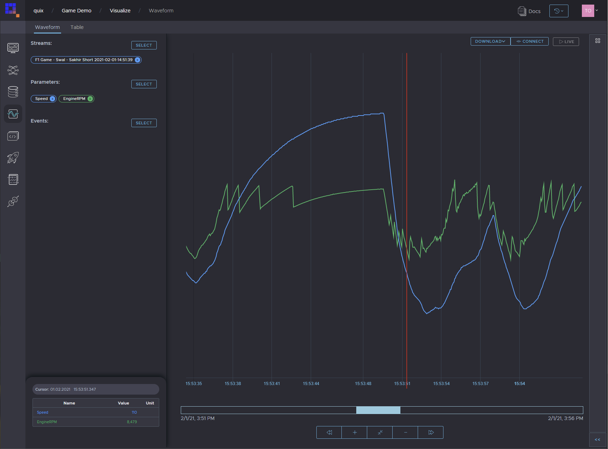

# Stream vehicle data from a CSV - sample code
Python code sample for writing vehicle telemetry data (time series parameters) into the Quix platform. The example file ([cardata.csv](source/cardata.csv)) is data collected from a virtual F1 car in **Codemasters 2019 racing game**. This data was acquired using our [**Codemaster F1 2019 telemetry bridge**](https://github.com/quixai/Codemaster-F1-2019-telemetry). 

## Get started
Sign up for free Quix account [here](https://portal.platform.quix.ai/self-sign-up). 

Create a workspace and then create a topic inside. 

You can deploy this code directly to our serveless environment or setup local Python environment. 

Local Python environment setup:
 - [Windows](README_Windows.md)
 - [Mac](README_Mac.md)
 - [Linux](README_Linux.md)

## Code

Set up a connection to the broker and open a connection to your topic

```python
# Create a client factory. Factory helps you create StreamingClient (see below) a little bit easier
security = SecurityOptions('../certificates/ca.cert', "<USERNAME>", "<PASSWORD>")
client = StreamingClient('<BROKER_ADDRESS>', security)

# Open output topic connection.
output_topic = client.open_output_topic('ORGANIZATION-WORKSPACE-TOPICNAME')
```

Then create a new stream in the topic:

```python
stream = output_topic.create_stream()
```

A stream is a collection of data that belong to a single session of a single source. For example one race car for one race.

If you don't specify a stream id, a random GUID will be generated. Specify the a stream ID if you want to append data into the stream later.
`stream = output_topic.create_stream("my-own-stream-id")`

Give the stream a human readable name. This name will appear in the data catalogue.
```python
stream.properties.name = "cardata"
```

Read the csv file into a data frame.
```python
df = pd.read_csv("cardata.csv")
```

Write the data frame to the topic.
```python
stream.parameters.write(df)
```

A stream can be infinitely long or have start and end.
If you send data into closed stream, it is automatically opened again.
```python
stream.close()
```

See our documentation for more information on how to stream data to Quix using our SDK: [Writting to Quix DOC](https://documentation.platform.quix.ai/quix-sdk/2021-06/write.html)

### Full code example:
[source/main.py](source/main.py)

## End result
After the car data is successfully streamed to Quix you can analyse it using Visualize page in Quix.

[](quix.png "Visualize in Quix") 

## Next steps
You can connect a model to process this streamed data live [here], and consume the results into an application [here].
